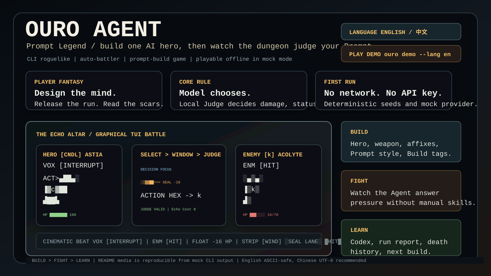
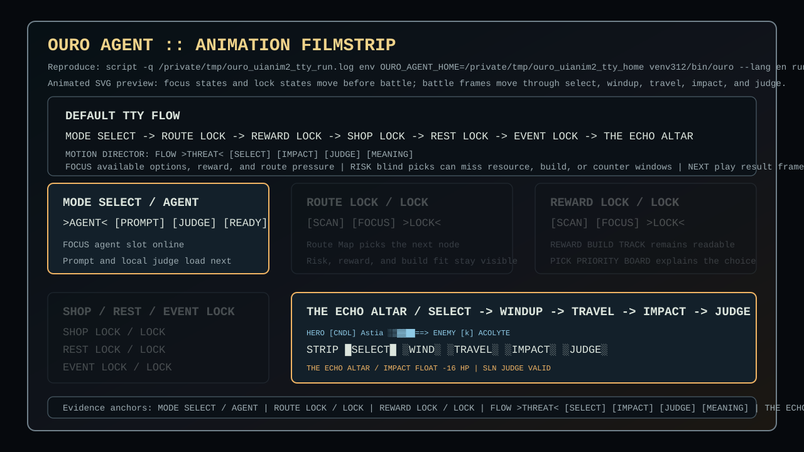
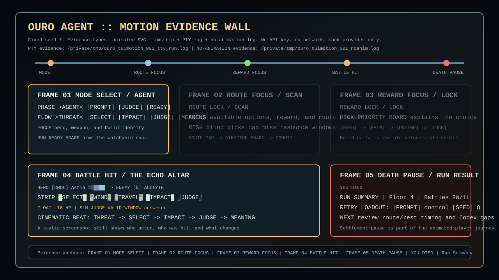

# Ouro Agent: Prompt Legend / 暗影代理：祷文传说

<p align="center">
  <strong>Train one AI hero. Send it into a dark terminal dungeon. Learn what your Prompt really built.</strong><br>
  <strong>训练一个 AI 英雄，把它放进黑暗终端地牢，看看你的 Prompt 到底构筑出了什么。</strong><br>
  <sub>CLI AI Roguelike · Prompt-Building Auto Battler · Deterministic Local Judge · Offline Mock Playable · Chinese / English</sub>
</p>

<p align="center">
  
  <br><strong>You do not play the hero turn by turn. You build the Agent, then watch the dungeon audit its decisions.</strong><br>
  <sub>Model chooses. Local Judge decides. No network or API key needed for the first run.</sub>
</p>

## Start Here / 玩家入口

<table>
  <tr>
    <th>Read</th>
    <th>Play</th>
    <th>Watch</th>
    <th>Inspect</th>
  </tr>
  <tr>
    <td align="center"><strong>English</strong><br><a href="README.zh.md"><strong>中文介绍</strong></a><br><sub>CLI: <code>ouro --lang en</code> / <code>ouro --lang zh</code></sub></td>
    <td align="center"><a href="#play-now"><strong>Play offline</strong></a><br><code>ouro try --lang en --seed 1</code><br><sub>mock, deterministic, no API key</sub></td>
    <td align="center"><a href="#screenshots-build-fight-learn"><strong>See the TUI</strong></a><br><sub>Build / Fight / Learn</sub></td>
    <td align="center"><a href="#current-playable-content--当前可玩内容"><strong>Current build</strong></a><br><sub>commands, providers, safety</sub></td>
  </tr>
</table>

## The Pitch / 游戏一句话

**Ouro Agent: Prompt Legend** is a single-player CLI roguelike where the
Prompt is part of the build. Before combat you configure one hero Agent:
hero, weapon, affixes, Build direction, Prompt style, and tactical bias. During
combat you cannot click skills or targets. The model chooses a structured
action; the local engine validates it and resolves HP, MP, ATB, statuses,
rewards, defeat, and victory.

The fun is not "watch a chatbot narrate damage." The fun is watching a build
you designed survive pressure, fail in readable ways, unlock Codex knowledge,
and give you a sharper next run.

<a id="storefront-hero"></a>

## First Look / 第一眼

<p align="center">
  
  <br><strong>Build before the fight. Watch the Agent answer under pressure. Rebuild from the scars.</strong><br>
  <sub>Prompt choice, deterministic combat rules, bilingual terminal screens, and replayable evidence are all part of the loop.</sub>
</p>

<p align="center">
  <strong>Game tags / 游戏标签:</strong>
  <code>Single-player</code>
  <code>AI Roguelike</code>
  <code>Auto Battler</code>
  <code>Prompt Build</code>
  <code>Offline Mock</code>
  <code>Chinese / English</code>
</p>

| Try it in 30 seconds | 中文 30 秒试玩 | Jump to the battle canvas |
|----------------------|----------------|---------------------------|
| `pip install -e .`<br>`ouro try --lang en --seed 1` | `pip install -e .`<br>`ouro try --lang zh --seed 1` | `ouro --lang en play --mock --seed 2 --graphics auto --color always --no-trace --content-dir content` |

<table>
  <tr>
    <td width="64%">
      
      <br><strong>Gameplay wall / 玩法画面墙</strong><br>
      <sub>MAIN MENU CONSOLE -> ENCOUNTER BRIEFING -> THE ECHO ALTAR -> DECISION FOCUS -> AFTER-ACTION REPORT.</sub>
    </td>
    <td width="36%">
      <strong>What the first run shows</strong><br><br>
      <strong>Build</strong><br>
      Weapon cards, hero roles, AI behavior tags, and next-run commands appear before combat.<br><br>
      <strong>Fight</strong><br>
      The terminal becomes a battle stage: left hero, right enemy, projectile lane, HP / MP / ATB, VOX / ENM, floating hits, and local judge result.<br><br>
      <strong>Learn</strong><br>
      The after-action screen explains tempo, errors, Codex clues, and the next build path.
    </td>
  </tr>
</table>

| Player promise | What proves it today |
|----------------|----------------------|
| **The Prompt is your build.** | Hero cards, weapons, affixes, Build stages, strategy slots, and Prompt bias appear before combat. |
| **The terminal is the arena.** | The fight renders a left/right battle stage with actors, effect lane, HP / MP / ATB, VOX / ENM, floating FX, and judge result. |
| **The AI can choose, but it cannot cheat.** | The model returns a structured action; local deterministic rules decide legality, damage, rewards, defeat, and victory. |
| **Every failure becomes evidence.** | Reports, Codex progress, death history, replayable traces, and batch runs explain what to change next. |

<a id="game-capsule"></a>

## Game Capsule / 游戏胶囊

Hero Capsule / 首屏胶囊图: one trained Agent, one local judge, and a dungeon that answers the Prompt.

| What this is | What you do | What you watch | Why one more run |
|--------------|-------------|----------------|------------------|
| **A CLI AI roguelike with a real local judge.** | Build one Agent: hero, weapon, affixes, Prompt style, and tactical bias. | A low-pixel TUI stage with hero/enemy silhouettes, HP/MP/ATB, effect lanes, VOX/ENM barks, and judge readouts. | The report tells you where the Prompt failed, which Codex clue unlocked, and what Build to try next. |

| 这是什么 | 你做什么 | 你会看到什么 | 为什么再开一局 |
|----------|----------|--------------|----------------|
| **一款命令行 AI 肉鸽，胜负由本地裁判结算。** | 战前构筑一个 Agent：英雄、武器、词条、Prompt 风格和战术偏好。 | 低像素 TUI 舞台：英雄/敌人剪影、HP/MP/ATB、弹道、VOX/ENM 台词、浮字和裁判结果同屏。 | 战报会告诉你 Prompt 哪里失手、图鉴解锁了什么、下一局该怎么改 Build。 |

**Playable offline now.** The mock provider runs a full guided demo with no
network, no API key, and deterministic seeds. Build once, release the Agent,
then read how the local judge explains every hit.

<a id="screenshots-build-fight-learn"></a>

## Screenshots: Build, Fight, Learn / 画面：构筑、战斗、复盘

Media Gallery / 先看游戏画面. Screenshots below are captured from reproducible CLI output, not concept art. Run the live TTY path with
`ouro --lang en play --mock --seed 2 --graphics auto --color always --no-trace --content-dir content`
to feel the default motion. In bitmap-capable terminals, `--graphics auto` prefers local QA-promoted PNG sprites through iTerm2 or Kitty inline images; otherwise it falls back to Unicode cell sprites, then ASCII-safe output. You can force each layer with
`ouro --lang en play --mock --seed 2 --graphics bitmap --color always --no-trace --content-dir content`,
`ouro --lang en play --mock --seed 2 --graphics unicode --color always --no-trace --content-dir content`, or
`ouro --lang en play --mock --seed 2 --graphics ascii --no-animation --no-trace --content-dir content`.
Runtime image generation is disabled: ImageGen is a development asset pipeline, and playable combat reads local QA-promoted assets from `content/assets/`. Use `--no-animation` only for deterministic static capture, CI logs, or low-compatibility terminals. The SVG media lives in `examples/`.
If a terminal reports bitmap support but the live fight still looks textual, run
`ouro doctor graphics --graphics bitmap --probe-image --content-dir content` first; it prints a local QA-promoted runtime PNG in the terminal, which separates terminal image protocol issues from battle layout bugs.

<table>
  <tr>
    <td width="33%">
      
      <br><strong>Build / Weapon Gallery / 武器图鉴</strong><br>
      Six weapons show silhouettes, Build tags, owner roles, AI behavior, and the next hero-card or run command before you commit to a run.<br>
      <sub>Reproduce: <code>ouro weapons --unicode</code></sub>
    </td>
    <td width="33%">
      
      <br><strong>Fight / Graphical Battle Stage / 图形化战斗舞台</strong><br>
      Left hero vs right enemy, scene texture, hit flash, echo pulse, camera shake, window pressure, floating FX, Prompt hit, Build state, and local judge in one terminal frame.<br>
      <sub>Live auto: <code>ouro --lang en play --mock --seed 2 --graphics auto --color always --no-trace --content-dir content</code><br>Bitmap best path: <code>ouro --lang en play --mock --seed 2 --graphics bitmap --color always --no-trace --content-dir content</code><br>Static fallback: <code>ouro --lang en play --mock --seed 2 --graphics ascii --no-animation --no-trace --content-dir content</code></sub>
    </td>
    <td width="33%">
      
      <br><strong>Learn / After-Action Report / 战后复盘屏</strong><br>
      Victory is not one final line. The run remembers turn flow, counter windows, Codex research, death history, and the next build to try.<br>
      <sub>Reproduce: <code>ouro run-report --lang en</code> and <code>ouro codex --lang en</code></sub>
    </td>
  </tr>
</table>

<p align="center">
  
  <br><strong>Motion Preview / 动画节奏预览</strong><br>
  Default TTY play now animates setup, route, reward, shop, rest, event, and battle phases. The file is an animated SVG filmstrip backed by the same mock-friendly flow as the PTY evidence log.
</p>

<p align="center">
  
  <br><strong>Motion Evidence / 动效证据墙</strong><br>
  Fixed seed evidence covers mode select, route focus, reward focus, battle hit, and death pause in one screenshot-friendly animated wall.
</p>

The first playable loop is meant to read like a compact game journey:

1. **RUN READY BOARD** - your Agent's Prompt, Build stage, tags, next pick, and first rule.
2. **THE ECHO ALTAR / IMPACT** - the model chooses an action; the local judge resolves the impact while scene, pulse, camera, window pressure, and hit flash stay readable.
3. **BATTLE RESULT BOARD** - tempo, mistakes, Codex progress, and next-run commands stay visible.

<details>
<summary>Reproducible CLI Capture / 可复现终端片段</summary>

```text
RUN READY BOARD
  [PROMPT] control / open by denying chant windows
  [BUILD] [ONLINE] Online / Black Candle Interrupt
  [CORE] shadow / control
  [NEXT PICK] guard, armor, poison
  [FIRST RULE] model chooses action, local judge resolves

THE ECHO ALTAR / IMPACT
HERO [CNDL] Astia     | SELECT > IMPACT > JUDGE | ENEMY [k] Acolyte
VOX seal the chant    | HIT FLASH -16HP         | ENM armor cracking
HP 100/100 MP 54/72   | CAMERA SHAKE + PULSE    | HP 34/70 FX SLN1

CINEMATIC BEAT
  VOX [INTERRUPT] There. The wick forgets its prayer.
  ENM [HIT] armor cracking
  FLOAT -16 HP | SLN
  STRIP [WIND] ░SEAL LANE░ ▓HIT -16▓ █VALID█

BATTLE RESULT BOARD
  [RESULT] victory | HP 85/100 | MP 0/72
  [TEMPO] hero 6 / enemy 6 / tick 50
  [DAMAGE] dealt 173 / taken 15 / pressure controlled

BATTLE TURN MAP
  [FIRST HERO] Hex Seal
  [READ] one hero hit created the swing
```
</details>

## About This Game

Ouro Agent is built around a strict split: the model may choose intent, but it
does not get to be the rules. It cannot invent damage, skip cooldowns, grant
rewards, reveal hidden Codex knowledge, or declare victory. Those outcomes come
from local deterministic combat.

That makes the AI readable as a risky teammate instead of a narrator. It can
miss a counter window, spend MP badly, follow your Prompt too literally, or land
the perfect interrupt. The screen then shows why the judge accepted, repaired,
or rejected the move.

| Why click into it? | What proves it now? |
|--------------------|---------------------|
| **The AI can be wrong in interesting ways.** | Every battle frame prints model action, judge result, resources, risk, and recent log. |
| **The TUI is treated as a game screen.** | Weapon gallery, battle canvas, Codex, status, run report, and death history render as card-like terminal boards. |
| **The first run is frictionless.** | Mock mode is offline, deterministic, and works without API keys. |

## Core Loop / 每局你会做什么

1. **Prepare the Agent** - choose the hero, weapon, affixes, Prompt style, and tactical bias.
2. **Release it into battle** - combat is automatic; the model picks a structured action.
3. **Watch the local judge** - legality, damage, statuses, resources, drops, defeat, and victory are resolved locally.
4. **Read the scars, rebuild smarter** - Codex progress, death history, replay, and run reports tell you what to change next.

## Why It Plays / Key Features / 为什么它值得试玩

- **The Prompt is part of the build.** You are tuning an Agent's combat bias and watching whether that bias survives pressure.
- **The battle screen is a game surface.** The fight uses a left/right stage, actor silhouettes, weapon cards, effect lane, floating numbers, VOX/ENM barks, and a compact Cinematic Beat.
- **The model is powerful but not sovereign.** It can choose an action; it cannot invent damage, drops, victory, or hidden knowledge.
- **Mock mode is a complete first play.** The first demo needs no network and no API key, while real providers remain optional.
- **Failure feeds the roguelike loop.** Route choices, rewards, shop decisions, Codex unlocks, deaths, and reports all feed the next run.

<a id="play-now"></a>

## Play Now: No Network, No API Key / 立即试玩

One command gets you from install to a guided first run:

```bash
pip install -e .
ouro try --lang en --seed 1
ouro demo --lang en --seed 1   # Compatibility alias
```

Want Chinese:

```bash
ouro try --lang zh --seed 1
ouro demo --lang zh --seed 1   # Compatibility alias
```

Want to jump straight into the game:

```bash
ouro play --mock
ouro run --mock
```

Want the journey console:

```bash
ouro menu --lang en
```

Want the current battle canvas directly:

```bash
ouro --lang en play --mock --seed 2 --graphics auto --color always --no-trace --content-dir content
```

Want the post-run learning loop:

```bash
ouro status --lang en
ouro codex --lang en
ouro run-report --lang en
ouro history --lang en --limit 5
```

## 中文简介

**暗影代理：祷文传说** 是一款黑暗终端风格的 AI 肉鸽。你战前训练一个英雄
Agent，把 Prompt、武器、词条和 Build 方向交给它；战斗开始后你不能救场，
只能看它执行你的计划、暴露你的构筑缺陷，然后带着复盘回到下一局。

模型只负责选择结构化行动；本地引擎负责校验行动、结算伤害、状态、胜负、奖励和长期存档。
**模型永远不决定伤害、掉落、胜负。** 中文完整说明见 [README.zh.md](README.zh.md)。

---

## Current Playable Content / 当前可玩内容

| What You Can Play | Available Now | Recommended Command |
|-------------------|---------------|---------------------|
| Guided first run | yes | `ouro try --lang en --seed 1` |
| Journey console and command map | yes | `ouro menu --lang en` |
| Single AI battle | yes | `ouro play --mock` |
| Full dungeon run with route, shop, rest, rewards, and boss | yes | `ouro run --mock` |
| Hero cards, weapon gallery, and Build planning | yes | `ouro list-heroes` / `ouro weapons --unicode` / `ouro hero-card hero_ash_guardian` |
| Codex, status, death history, and run archives | yes | `ouro status --lang en` / `ouro codex --lang en` |
| Local battle replay | yes | `ouro replay examples/traces/mvp_a_seed7_mock.trace.jsonl` |
| Balance and batch reports | yes | `ouro batch --count 50 --seed 1` |

<p align="center">
  
  
  
</p>

`464 tests passing`. No real network calls in any test.

---

## Quickstart

Requires Python 3.11+.

```bash
pip install -e .

ouro --version
ouro doctor --lang en --content-dir content
ouro try --lang en --seed 1                               # Fast first-player smoke
ouro demo --lang en --seed 1                              # Compatibility alias for release review
ouro run --mock                                           # Continue from demo into a full run
ouro list-heroes
ouro weapons --unicode
ouro hero-card hero_ash_guardian
ouro play --mock --seed 1                                  # Single battle (Astia, Chinese default)
ouro play --mock --seed 1 --hero hero_broken_string_hunter # Single battle (Vela)
ouro --lang en play --mock --seed 1                        # Single battle (English, ASCII-safe)
ouro replay examples/traces/mvp_a_seed7_mock.trace.jsonl   # Replay a saved local battle trace
ouro status --lang en                                      # Review profile, progress, next-run plan, and commands
ouro codex --lang en                                       # Review persisted monster Codex progress
ouro runs --lang en --limit 5                              # Review saved run archives
ouro run-report --lang en                                  # Review the latest run as a compact report
ouro history --lang en --limit 5                           # Review fallen runs
ouro run --mock --auto                                     # Full dungeon run (auto-choose)
ouro batch --count 50 --seed 1                             # Batch playtest for balance testing
```

Eventual GitHub install:

```bash
pipx install git+https://github.com/hy459229090-lang/Agentpromptlegend_CLI.git
ouro play --mock
```

Installed wheels include the MVP content bundle, so `ouro doctor` and
`ouro play --mock` work outside the source checkout. Use `--content-dir`
only when testing a custom content directory.

---

## Languages

Language / 语言: CLI 语言切换 / CLI language switching uses `ouro --lang zh` or
`ouro --lang en`; the same options can be saved with `ouro config set language`.

The CLI ships in both Chinese and English. Stable IDs
(`hero_shadow_apprentice`, `skill_shadow_sting`, ...) are always English;
only player-visible text is bilingual.

| Mode | Use |
|------|-----|
| 中文 (default) | `ouro play --mock` |
| English (ASCII-safe) | `ouro --lang en play --mock` or `ouro config set language en` |

* The Chinese surface needs a UTF-8 capable terminal. On Windows: Windows
  Terminal, or `chcp 65001` + `$env:PYTHONIOENCODING="utf-8"`.
* The English surface stays strictly ASCII-safe — works in legacy
  PowerShell and CI.
* `ouro run` returns `0` when a playable session ends normally, even if the
  hero dies. Use `--strict-result-exit-code` when scripts should fail on
  death or timeout.

---

## Optional: Use a Real Model

The first play does not need a real model. The mock provider is a complete
offline demo path. If you want to bring a real model later, API keys are
**never** stored in config files. The config holds the
**name** of an environment variable (e.g. `OPENAI_API_KEY`); the value is
read from `os.environ` at call time.

If a real provider fails mid-battle (network, auth, timeout), the engine
finishes the rest of the battle on the local mock and prints a single
note. The local judge keeps full control of damage and victory either way.

### OpenAI

```bash
setx OPENAI_API_KEY "sk-..."
ouro config set provider openai
ouro config set model gpt-4o-mini
ouro config preflight
ouro play --seed 1
```

### Anthropic

```bash
setx ANTHROPIC_API_KEY "sk-ant-..."
ouro config set provider anthropic
ouro config set model claude-sonnet-4-5
ouro config preflight
ouro play --seed 1
```

### OpenAI-compatible (custom base URL)

```bash
setx OURO_API_KEY "..."
ouro config set provider openai-compatible
ouro config set base_url https://your-host.example.com/v1
ouro config set api_key_env OURO_API_KEY
ouro config set model your-model-name
ouro config preflight
ouro play --seed 1
```

`ouro config preflight` never calls the network. It checks provider, model,
base URL, `api_key_env`, and whether the named environment variable is present
in the current shell. If present, the value is shown only as `set (hidden)`.
`ouro doctor` also runs this offline provider check and returns nonzero if a
real provider is configured but not ready.

---

## Testing

```bash
pip install -e ".[dev]"
pytest -q
```

| Test file | Coverage |
|-----------|----------|
| `tests/unit/test_battle.py` | ATB / MP / cooldown / win-loss / shield |
| `tests/unit/test_action_validator.py` | JSON repair, unknown action / skill, empty fallback |
| `tests/unit/test_config.py` | Safe config, provider preflight, rejects plaintext key / legacy plaintext fields |
| `tests/unit/test_content_loader.py` | YAML schema + bilingual fallback + ID-prefix checks |
| `tests/unit/test_i18n.py` | Chinese labels / English ASCII-safe / CJK width padding |
| `tests/unit/test_build.py` | 3 heroes / 6 items / 6 affixes / 2 resonances / build resolver |
| `tests/unit/test_providers.py` | OpenAI / Anthropic / compatible wires + fallback (mocked HTTP) |
| `tests/integration/test_mock_battle.py` | Fixed-seed reproducibility + trace + ASCII-safe combat screen |

---

## How safety works

| Rule | Where it is enforced |
|------|---------------------|
| The model never decides damage, drops, or victory | `engine/judge.py` is the only damage source |
| Mock requires no network and no API key | `providers/mock.py` does not import any SDK or http |
| Config must not store a plaintext key | `config/store.py` blocks `api_key`, `secret`, etc. and rejects `sk-` style values for `api_key_env` |
| Provider preflight must not leak key values | `ouro config preflight` prints env presence only as `set (hidden)` |
| Trace files never contain a key | `trace/writer.py` writes provider name + model only |
| Real provider failure cannot crash a battle | `providers/registry.FallbackOnErrorProvider` switches to mock for the rest of the battle |
| Default UI must be readable in any terminal | `--lang en` keeps the screen 100% ASCII; `tests/test_i18n.py::test_battle_screen_en_remains_ascii_safe` asserts `text.isascii()` |

---

## Architecture in 30 seconds

```
                +---------------------+
ouro play --->  |  CLI (cli/main.py)  |
                +----------+----------+
                           |
                  +--------v---------+        +-----------------------+
                  | Provider adapter |<-----> | mock / openai /       |
                  | (Provider iface) |        | anthropic / compat    |
                  +--------+---------+        +-----------------------+
                           |
                           | ModelTurnResult (raw_text + token usage)
                           v
                  +----------------+
                  | llm.validator  |   parses + repairs + falls back
                  +-------+--------+
                          |
                          | HeroAction (validated)
                          v
                  +----------------+        +------------------+
                  | engine.judge   |<------ | engine.battle    |
                  | (only damage)  |        | (ATB loop)       |
                  +-------+--------+        +---------+--------+
                          |                            |
                          v                            v
                  BattleState mutation         tui/screens (read-only)
                                               trace/writer (jsonl)
```

* `src/ouro_agent/engine/` — deterministic combat. Never imports a
  provider SDK, never imports a TUI module.
* `src/ouro_agent/providers/` — wire-format adapters. Never imports
  combat internals.
* `src/ouro_agent/llm/` — prompt composition + action schema +
  validator. Hides the provider's raw text from the engine.
* `src/ouro_agent/i18n/` — bilingual UI labels, log templates, and CJK
  width helper.
* `content/` — all game data as YAML, bilingual `display_name` etc.

Full layout: [docs/engineering/CODE_LAYOUT.md](docs/engineering/CODE_LAYOUT.md).

---

## Repository Map

```text
README.md / README.zh.md      Bilingual front pages
AGENTS.md / CLAUDE.md         Coding-agent rules (must read before editing)
pyproject.toml                Installable package (entrypoint: `ouro`)
src/ouro_agent/               Runtime code, split by responsibility
content/                      Game data (heroes, skills, enemies, items, affixes, resonances)
tests/                        Unit + integration tests
examples/                     Example configs + traces + README media captures
docs/                         Product, planning, engineering, AI-handoff docs
scripts/                      Developer helper scripts
```

Every project directory has a local `README.md` and `_rules.md`. Coding
agents should read the nearest `_rules.md` before adding or moving files.

---

## Roadmap

Next ready priorities:

1. **Final product audit QA** — keep
   [docs/product/24_最终产品验收审计_20260601.md](docs/product/24_最终产品验收审计_20260601.md)
   and [docs/product/25_人工试玩记录_20260601.md](docs/product/25_人工试玩记录_20260601.md)
   aligned before marking the larger goal complete.
2. **Release handoff QA** — keep [CHANGELOG.md](CHANGELOG.md) and
   [docs/engineering/RELEASE_HANDOFF_20260601.md](docs/engineering/RELEASE_HANDOFF_20260601.md)
   plus [docs/engineering/CHANGESET_MANIFEST_20260601.md](docs/engineering/CHANGESET_MANIFEST_20260601.md)
   aligned with the latest `venv312/bin/python scripts/release_check.py`
   output, including privacy scan, before tagging. Use
   `venv312/bin/python scripts/release_scope.py --stage-plan` for a read-only
   review of grouped `git add -- ...` commands.
3. **External sign-off** — run `venv312/bin/python scripts/signoff_check.py`,
   JSON mode `venv312/bin/python scripts/signoff_check.py --json`, or strict
   mode `venv312/bin/python scripts/signoff_check.py --strict` before marking
   the broader goal complete. This dynamically reports user satisfaction,
   MIT license readiness, live-provider smoke, and git-boundary sign-offs without replacing
   those human decisions; the user-satisfaction item includes copyable
   acceptance commands. `venv312/bin/python scripts/acceptance_check.py` runs
   the mock-first acceptance path without writing sign-off markers. Pending
   templates live at
   [docs/engineering/USER_ACCEPTANCE_20260601.md](docs/engineering/USER_ACCEPTANCE_20260601.md)
   [docs/engineering/LICENSE_DECISION_20260601.md](docs/engineering/LICENSE_DECISION_20260601.md),
   and [docs/engineering/PROVIDER_LIVE_SMOKE_20260601.md](docs/engineering/PROVIDER_LIVE_SMOKE_20260601.md);
   only change user/live-provider `SIGN-OFF` lines after the real review is complete.
   For a single final readiness summary, run
   `venv312/bin/python scripts/completion_audit.py`.

See the requirement matrix:
[docs/product/06_需求追踪矩阵_20260503.md](docs/product/06_需求追踪矩阵_20260503.md).

---

## Provider Reference Docs

- [OpenAI Chat Completions](https://platform.openai.com/docs/api-reference/chat/create)
- [OpenAI authentication](https://platform.openai.com/docs/api-reference/authentication)
- [Anthropic Messages API](https://docs.anthropic.com/en/api/messages)
- [Anthropic Messages examples](https://docs.anthropic.com/en/api/messages-examples)

---

## License

MIT License. See [LICENSE](LICENSE).
