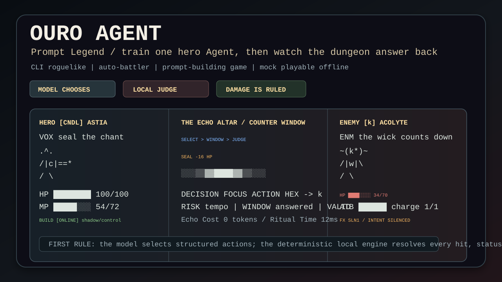
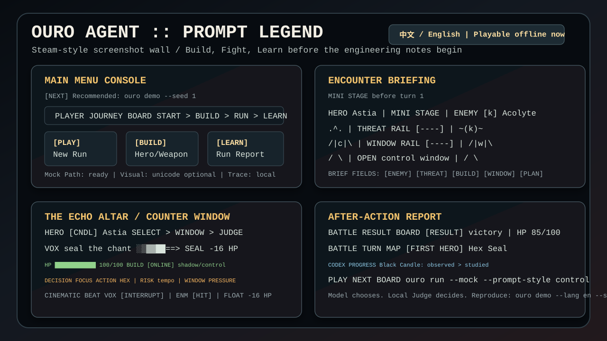
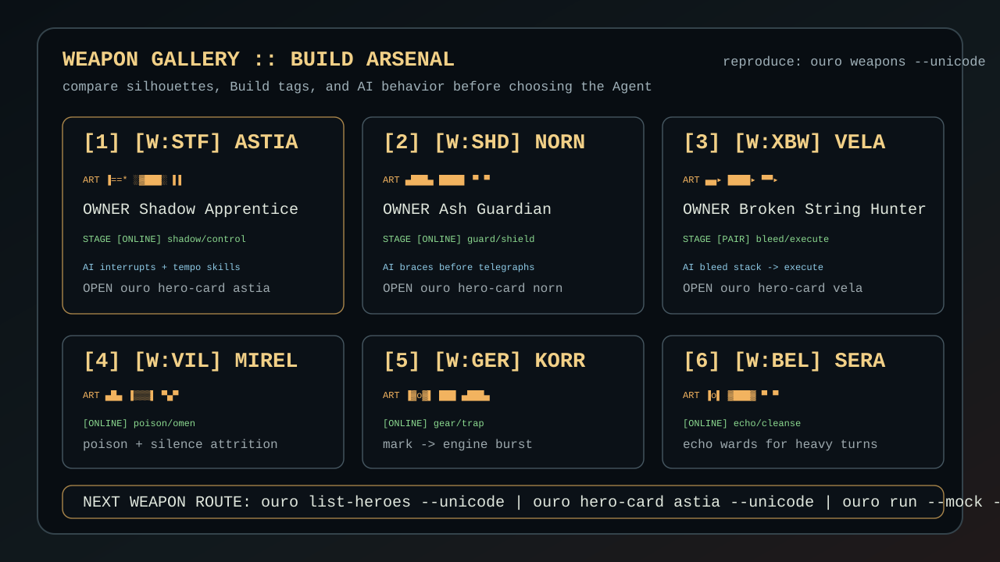
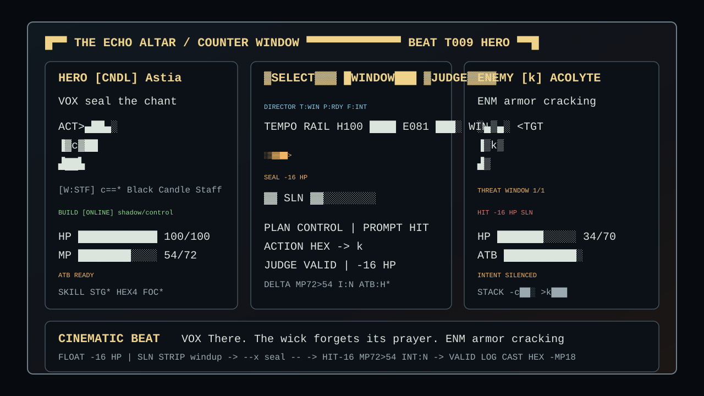
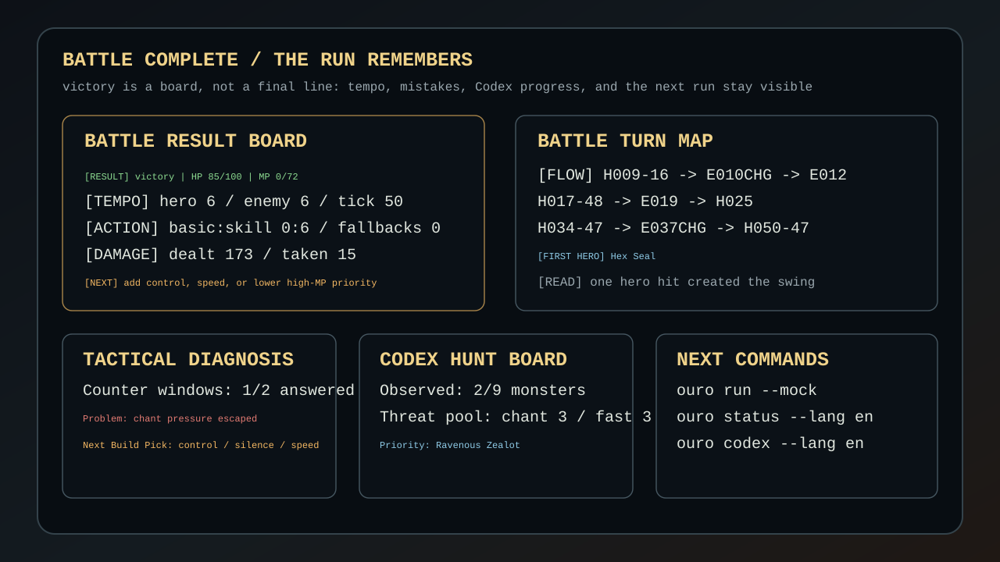

# 暗影代理：祷文传说 / Ouro Agent: Prompt Legend

<p align="center">
  <strong>训练一个 AI 英雄，让它带着你的 Prompt 下地牢。</strong><br>
  <strong>Train one AI hero. Watch it survive your Prompt.</strong><br>
  <sub>命令行 AI 肉鸽 · Prompt 构筑自动战斗 · Mock 离线可玩 · 中英双语 TUI</sub>
</p>

<p align="center">
  <strong>语言切换 / Language: 中文 / English</strong><br>
  <strong>中文介绍页</strong>
  &nbsp;|&nbsp;
  <a href="README.md#english-store-page"><strong>English Store Page</strong></a>
  &nbsp;|&nbsp;
  <a href="README.md"><strong>双语首页 / Bilingual README</strong></a>
  &nbsp;|&nbsp;
  <strong>CLI 语言切换 / CLI Language Toggle:</strong>
  <code>ouro --lang zh</code> / <code>ouro --lang en</code>
</p>

<table>
  <tr>
    <th>中文入口</th>
    <th>English Entry</th>
    <th>立即试玩</th>
    <th>先看画面</th>
  </tr>
  <tr>
    <td align="center"><strong>当前中文介绍页</strong><br><sub>不是工程日志开场</sub></td>
    <td align="center"><a href="README.md#english-store-page"><strong>Read in English</strong><br><sub>game pitch first, engineering later</sub></a></td>
    <td align="center"><a href="#play-now"><strong>Mock Demo</strong><br><sub>离线、可复现、无需 API key</sub></a></td>
    <td align="center"><a href="#screenshots-build-fight-learn"><strong>Media Gallery</strong><br><sub>Build / Fight / Learn</sub></a></td>
  </tr>
</table>

<a id="storefront-hero"></a>

## 商店页封面 / Storefront Hero

<p align="center">
  
  <br><strong>选择语言，先看地牢动起来。</strong><br>
  <br><strong>你不是逐回合操控英雄的人。你是在设计它带进地牢的那颗脑子。</strong><br>
  <strong>暗黑 Roguelike。先搭建，一局看生死。你是构筑师，不是放技能的人。</strong><br>
  <strong>A dark terminal roguelike: build one Agent, then watch it survive by decision + rules, not by button-mashing.</strong><br>
  <sub>训练一个 AI 英雄，让它带着你的 Prompt 下地牢。模型只选招式，裁判负责结算。Model chooses. Local Judge decides.</sub>
</p>

| Steam 商店页式卖点 | 在游玩里意味着什么 |
|--------------------|--------------------|
| **Prompt 就是你的 Build。** | 你在战前调校一个 Agent，开战后看这套策略在压力里成立还是崩盘。 |
| **终端不是日志，而是竞技场。** | TUI 同屏展示左英雄 vs 右敌人、弹道、HP / MP / ATB、VOX / ENM 台词、命中浮字和本地裁判结果。 |
| **AI 能选择，但不能作弊。** | 模型只输出结构化行动；合法性、伤害、奖励、失败和胜利都由确定性本地规则结算。 |
| **每次失败都服务下一局。** | 战报、Codex 进度、死亡历史和可回放 trace 会把失败变成下一次构筑建议。 |

<p align="center">
  <strong>游戏标签：</strong>
  <code>单人</code>
  <code>AI 肉鸽</code>
  <code>自动战斗</code>
  <code>Prompt 构筑</code>
  <code>Mock 离线</code>
  <code>中文 / English</code>
</p>

<table>
  <tr>
    <th colspan="4">Steam 风格首页 / Steam-Style Front Page · 选择介绍页 / Choose Your Page</th>
  </tr>
  <tr>
    <td align="center"><strong>中文 / Chinese</strong><br><sub>当前页面</sub></td>
    <td align="center"><a href="README.md#english-store-page"><strong>English Store Page</strong><br><sub>英文介绍页</sub></a></td>
    <td align="center"><a href="#screenshots-build-fight-learn"><strong>先看最佳画面</strong><br><sub>先看游戏画面 / Media Gallery</sub></a></td>
    <td align="center"><a href="#play-now"><strong>立即试玩 / Play Now</strong><br><sub>Mock 离线，无需 API key</sub></a></td>
  </tr>
</table>

<p align="center">
  <strong>现在可离线试玩：无需网络、无需 API key，固定 seed 可复现。</strong><br>
  <strong>Playable now in mock mode: no network, no API key, deterministic seeds.</strong><br>
  <sub>先看画面，再看工程说明。Media first. Rules second. Engineering third.</sub>
</p>

| 中文 30 秒开局 | English 30-second start | 直接看战斗画面 |
|----------------|-------------------------|----------------|
| `pip install -e .`<br>`ouro demo --lang zh --seed 1` | `pip install -e .`<br>`ouro demo --lang en --seed 1` | `ouro --lang en play --mock --seed 2 --unicode --color always --no-animation --no-trace --content-dir content` |

| 第一眼会看到什么 | 为什么它不是普通 CLI demo |
|------------------|----------------------------|
| **Build** | 武器卡、英雄定位、AI 行为标签和下一局命令会在战斗前可见。 |
| **Fight** | 屏幕是左右对战舞台，而不是原始日志滚动。 |
| **Learn** | 战后复盘会解释节奏、失误、Codex 线索和下一次 Build 方向。 |

<p align="center">
  <strong>首屏胶囊图 / Hero Capsule</strong><br>
  <sub>一个被训练的 Agent，一个本地裁判，以及会反击 Prompt 的地牢。</sub>
</p>

<p align="center">
  
  <br><strong>商店式截图墙 / Steam-style screenshot wall</strong><br>
  <sub>MAIN MENU CONSOLE -> ENCOUNTER BRIEFING -> THE ECHO ALTAR -> DECISION FOCUS -> AFTER-ACTION REPORT。先看到真实 TUI 媒体，再读工程说明。</sub>
</p>

<details>
<summary>好的 Steam 页面会先展示什么 / What a Steam page would show first</summary>

| 好的 Steam 页面会先展示什么 | 这个 README 现在怎么处理 |
|-----------------------------|--------------------------|
| **胶囊图和截图墙** | 首屏先给胶囊主视觉、四格截图墙和 Build/Fight/Learn 画廊，再进入架构与 Provider 文档。 |
| **一句话玩家幻想** | 构筑一个 Agent，把它放进压力局，看你的 Prompt 能不能活下来。 |
| **可玩状态和行动按钮** | `ouro demo --lang zh --seed 1` 与 `ouro demo --lang en --seed 1` 放在工程说明之前。 |
| **用画面证明，不只写承诺** | 每张媒体图都标出可复现 CLI 命令，并展示 mock 可跑通的游戏界面。 |

</details>

## 游戏胶囊 / Game Capsule

| 这是什么 | 你做什么 | 你会看到什么 | 为什么再开一局 |
|----------|----------|--------------|----------------|
| **一款命令行 AI 肉鸽，胜负由本地裁判结算。** | 战前构筑一个 Agent：英雄、武器、词条、Prompt 风格和战术偏好。 | 低像素 TUI 舞台：英雄/敌人剪影、HP/MP/ATB、弹道、VOX/ENM 台词、浮字和裁判结果同屏。 | 战报会告诉你 Prompt 哪里失手、图鉴解锁了什么、下一局该怎么改 Build。 |

| What this is | What you do | What you watch | Why one more run |
|--------------|-------------|----------------|------------------|
| **A CLI AI roguelike with a real local judge.** | Build one Agent: hero, weapon, affixes, Prompt style, and tactical bias. | A low-pixel TUI stage with hero/enemy silhouettes, HP/MP/ATB, effect lanes, VOX/ENM barks, and judge readouts. | The report tells you where the Prompt failed, which Codex clue unlocked, and what Build to try next. |

**现在就能离线试玩。** 默认 mock provider 不需要网络、不需要 API key，
也不需要真实模型。最好的第一印象是：先构筑一次，把 Agent 放进战斗，
然后看本地裁判解释每一次命中、打断和失败。

<a id="screenshots-build-fight-learn"></a>

## 先看游戏画面：构筑、战斗、复盘 / Screenshots: Build, Fight, Learn

Media Gallery / 先看游戏画面。下面的画面来自可复现的 CLI 输出，不是概念图。
对应命令可用
`ouro --lang en play --mock --seed 2 --unicode --no-animation --no-trace --content-dir content`
复现。SVG 资产保存在 `examples/`。

<table>
  <tr>
    <td width="33%">
      
      <br><strong>Build / 武器图鉴 / Weapon Gallery</strong><br>
      六件武器同时展示轮廓、Build 标签、所属英雄、AI 行为和下一步 hero-card / run 命令，玩家能先比较再开局。<br>
      <sub>复现：<code>ouro weapons --unicode</code></sub>
    </td>
    <td width="33%">
      
      <br><strong>Fight / 图形化战斗舞台 / Graphical Battle Stage</strong><br>
      左英雄 vs 右敌人，中间弹道和本地裁判同屏；HP / MP / ATB / 风险条、浮字、Prompt 命中和 Build 状态都在一个战斗帧里。<br>
      <sub>复现：<code>ouro --lang en play --mock --seed 2 --unicode --no-animation --no-trace --content-dir content</code></sub>
    </td>
    <td width="33%">
      
      <br><strong>Learn / 战后复盘屏 / After-Action Report</strong><br>
      胜负不是一句结论，而是回合轨道、反制窗口、Codex 研究、死亡历史和下一局操作建议。<br>
      <sub>复现：<code>ouro run-report --lang zh</code> 和 <code>ouro codex --lang zh</code></sub>
    </td>
  </tr>
</table>

第一轮可玩流程应该像一个紧凑的游戏旅程：

1. **RUN READY BOARD**：展示你给 Agent 的 Prompt、Build 阶段、核心标签、下一次构筑选择和本地裁判规则。
2. **THE ECHO ALTAR / COUNTER WINDOW**：左英雄、右怪物、中间弹道；模型选择行动，本地裁判结算效果。
3. **BATTLE RESULT BOARD**：胜负、节奏、失误、Codex 研究和下一局命令留在屏幕上。

<details>
<summary>可复现终端片段 / Reproducible CLI Capture</summary>

```text
RUN READY BOARD
  [PROMPT] control / open by denying chant windows
  [BUILD] [ONLINE] Online / Black Candle Interrupt
  [CORE] shadow / control
  [NEXT PICK] guard, armor, poison
  [FIRST RULE] model chooses action, local judge resolves

THE ECHO ALTAR / COUNTER WINDOW
HERO [CNDL] Astia     | SELECT > WINDOW > JUDGE | ENEMY [k] Acolyte
VOX seal the chant    | SEAL -16 HP             | ENM armor cracking
HP 100/100 MP 54/72   | ACTION HEX -> k         | HP 34/70 FX SLN1

CINEMATIC BEAT
  VOX There. The wick forgets its prayer.
  FLOAT -16 HP | SLN
  STRIP [WIND] ░SEAL LANE░ ▓HIT -16▓ █VALID█

BATTLE RESULT BOARD
  [RESULT] victory | HP 85/100 | MP 0/72
  [TEMPO] hero 6 / enemy 6 / tick 50
  [DAMAGE] dealt 173 / taken 15 / pressure controlled

BATTLE TURN MAP
  [FIRST HERO] Hex Seal
  [READ] one hero hit created the swing
```
</details>

## 商店页速览

**暗影代理：祷文传说** 是一款可以直接试玩的 CLI AI 肉鸽。你不是地下城里的剑士，
而是战前调校 Agent 的构筑师：选择英雄、武器、词条、Build、Prompt 风格和战术偏好。
开战后你不能救场，只能看它执行你的计划、暴露你的构筑缺陷，然后带着复盘回到下一局。

模型只负责选择结构化行动；本地引擎负责校验目标、冷却、资源、伤害、状态、奖励、失败与胜利。
这个边界就是玩法：Prompt 可以聪明，但地牢仍然有规则。

| 游戏速览 / Storefront Snapshot | 当前承诺 |
|--------------------------------|----------|
| **类型** | CLI roguelike / auto-battler / prompt-building game |
| **玩家幻想** | 构筑一个 Agent，把它放进压力局，看它读局、犯错、打断仪式，并从失败中成长 |
| **语言切换 / Language** | README 有中英页面；CLI 语言切换使用 `ouro --lang zh` 或 `ouro --lang en` |
| **试玩状态** | 默认 mock provider 可离线、可复现、无需网络和 API key |
| **战斗规则** | 模型只选择行动；本地裁判负责合法性、伤害、奖励、失败和胜利 |
| **画面目标** | 图形化 TUI：左英雄 vs 右敌人、HP/MP/ATB、风险条、弹道中轴、`Echo Cost / Read Echo / Spoken Echo / Ritual Time`、浮字、VOX/ENM 台词和分镜节奏 |

| 玩家期待 | 你实际在做什么 | 它为什么不一样 |
|----------|----------------|----------------|
| 战前构筑，然后看 Agent 在压力下回答。 | 战前选择一个英雄、武器、词条、Build 标签、Prompt 风格和战术偏好。 | 游戏考验的是你的准备和 Prompt，而不是临场点技能速度。 |
| 战斗不是滚日志。 | 观看左右对战的 TUI 舞台：HP/MP/ATB、意图、风险、模型行动、本地裁判、浮字和台词同屏出现。 | CLI 被当作低分辨率游戏画面使用，不只是调试控制台。 |
| 每次失败都能指导下一局。 | 阅读战报、图鉴进度、死亡历史、状态页、回放和批量试跑结果，调整下一局构筑。 | 每个错误都会留下可复盘、可执行的下一步。 |

## 关于这个游戏

它不是“聊天接口加伤害数字”。Prompt 是构筑的一部分，模型输出是战术意图，
本地裁判保证地牢规则不会被模型绕过。

| 为什么值得点进来 | 现在有什么证据 |
|------------------|----------------|
| **AI 会以有趣的方式犯错。** | 每场战斗都显示模型行动、本地裁判、资源、风险和最近日志。 |
| **TUI 被当作游戏画面。** | 武器图鉴、战斗 Canvas、图鉴、状态页、战报和死亡历史都用卡片化终端界面呈现。 |
| **第一次试玩没有门槛。** | Mock 模式离线、可复现、无需 API key。 |

## 每局你会做什么

1. **构筑 Agent**：选择英雄、武器、词条、Prompt 模板和 Build 方向。
2. **放它进战斗**：战斗中模型只输出结构化行动，例如施放技能、选择目标、观察或防御。
3. **观看本地裁判结算**：本地引擎验证行动是否合法，并结算伤害、状态、资源、胜负和奖励。
4. **带着伤痕重构下一局**：每场战斗都会留下本地 trace、战报、图鉴进度和 run archive。

## 关键特色

- **AI 决策是核心玩法。** Prompt 不只是说明文字，而会影响 Agent 是否打断吟唱、是否保留 MP、是否优先处理高 ATB 敌人和 Boss 窗口。
- **TUI 有游戏画面感。** 当前战斗屏已经包含低分辨率 Canvas、左右对战舞台、角色与怪物像素形象、武器小卡、弹道、命中浮字、`VOX` 英雄台词和 `ENM` 敌方回应。
- **战斗不是黑盒。** `ENCOUNTER BRIEFING`、`MOMENTUM BOARD`、`CINEMATIC BEAT`、`BATTLE TURN MAP`、`BATTLE RESULT BOARD` 会解释威胁、势能、行动轨道和战后结论。
- **模型强，但不能篡改规则。** 模型只负责选择结构化行动；本地引擎负责校验行动、结算伤害、状态、胜负、奖励和长期存档。**模型永远不决定伤害、掉落、胜负。**
- **可离线试玩。** 默认 mock provider 无需网络、无需 API key，也能跑完整 demo、单场战斗、完整副本、图鉴、死亡历史和状态页。

<a id="play-now"></a>

## 立即试玩：无网络，无 API key

一条命令从安装进入引导式首局：

```bash
pip install -e .
ouro demo --lang zh --seed 1
```

想直接打一场或跑完整副本：

```bash
ouro play --mock
ouro run --mock
```

想看玩家旅程控制台：

```bash
ouro menu --lang zh
```

想看更强画面感：

```bash
ouro --lang en play --mock --seed 2 --unicode --color always --no-animation --no-trace --content-dir content
```

想看复盘和长期成长：

```bash
ouro status --lang zh
ouro codex --lang zh
ouro run-report --lang zh
ouro history --lang zh --limit 5
```

---

## 当前可玩内容

| 你能玩到什么 | 现在是否可用 | 推荐命令 |
|--------------|--------------|----------|
| 引导式首局试玩 | 可用 | `ouro demo --lang zh --seed 1` |
| 玩家旅程控制台与命令地图 | 可用 | `ouro menu --lang zh` |
| 单场 AI 战斗 | 可用 | `ouro play --mock` |
| 完整副本：路线、商店、休息、奖励和 Boss | 可用 | `ouro run --mock` |
| 英雄卡、武器图鉴和 Build 配置 | 可用 | `ouro list-heroes` / `ouro weapons --unicode` / `ouro hero-card hero_ash_guardian` |
| 图鉴、状态、死亡历史和运行归档 | 可用 | `ouro status --lang zh` / `ouro codex --lang zh` |
| 本地战斗回放 | 可用 | `ouro replay examples/traces/mvp_a_seed7_mock.trace.jsonl` |
| 批量试跑与数值报告 | 可用 | `ouro batch --count 50 --seed 1` |

<p align="center">
  
  
  
</p>

`387 测试通过`。任何测试都不联网。

---

## 快速开始

需要 Python 3.11+。

```bash
pip install -e .

ouro --version
ouro doctor --lang zh --content-dir content
ouro demo --lang zh --seed 1                              # 引导式首局试玩
ouro run --mock                                           # 从 demo 继续进入完整运行
ouro list-heroes
ouro weapons --unicode
ouro hero-card hero_ash_guardian
ouro play --mock --seed 1                                  # 单场战斗（默认中文 / 阿斯缇娅）
ouro play --mock --seed 1 --hero hero_broken_string_hunter # 单场战斗（薇拉）
ouro --lang en play --mock --seed 1                        # 单场战斗（英文 ASCII-safe）
ouro replay examples/traces/mvp_a_seed7_mock.trace.jsonl   # 回放本地战斗 trace
ouro status --lang zh                                      # 查看档案、进度、下一局计划与命令
ouro codex --lang en                                       # 查看持久化怪物图鉴进度
ouro runs --lang en --limit 5                              # 查看运行归档
ouro run-report --lang en                                  # 查看最近一局紧凑报告
ouro history --lang en --limit 5                           # 查看陨落记录
ouro run --mock --auto                                     # 完整副本（自动选择）
ouro batch --count 50 --seed 1                             # 批量试跑（数值平衡测试）
```

GitHub 安装路径（未来）：

```bash
pipx install git+https://github.com/hy459229090-lang/Agentpromptlegend_CLI.git
ouro play --mock
```

安装后的 wheel 内置 MVP 内容包，因此离开源码目录也可以直接运行
`ouro doctor` 和 `ouro play --mock`。只有测试自定义内容时才需要
`--content-dir`。

---

## 双语机制

语言切换 / Language：CLI 语言切换使用 `ouro --lang zh` 或
`ouro --lang en`，也可以通过 `ouro config set language` 保存默认语言。

ID（`hero_shadow_apprentice`、`skill_shadow_sting` 等）始终英文，
玩家可见文本中英双语。

| 模式 | 用法 |
|------|------|
| 中文（默认） | `ouro play --mock` |
| 英文（ASCII-safe） | `ouro --lang en play --mock` 或 `ouro config set language en` |

* 中文界面需要 UTF-8 终端。Windows 下推荐 Windows Terminal，
  或 PowerShell 中执行 `chcp 65001` + `$env:PYTHONIOENCODING="utf-8"`。
* 英文界面**严格 ASCII-safe**，可在传统 PowerShell 与 CI 中无障碍运行。
* `ouro run` 在一局正常结束时返回 `0`，即使英雄死亡也不是程序失败。
  如脚本需要死亡或超时返回非零，可使用 `--strict-result-exit-code`。

---

## 可选：接入真实模型

第一次试玩不需要真实模型。默认 mock provider 已经可以完整离线游玩。
如果后续要接入真实模型，API key **永远不**保存进配置文件。配置只存环境变量名（如
`OPENAI_API_KEY`），实际值在调用时从 `os.environ` 读取。

如果真实 provider 在战斗中失败（网络 / 鉴权 / 超时），引擎会
自动用本地 mock 完成本场剩余回合，并在结尾打印一行提示。
裁判（伤害与胜负）始终由本地引擎控制。

### OpenAI

```bash
setx OPENAI_API_KEY "sk-..."
ouro config set provider openai
ouro config set model gpt-4o-mini
ouro config preflight
ouro play --seed 1
```

### Anthropic

```bash
setx ANTHROPIC_API_KEY "sk-ant-..."
ouro config set provider anthropic
ouro config set model claude-sonnet-4-5
ouro config preflight
ouro play --seed 1
```

### OpenAI 兼容（自定义 base URL）

```bash
setx OURO_API_KEY "..."
ouro config set provider openai-compatible
ouro config set base_url https://your-host.example.com/v1
ouro config set api_key_env OURO_API_KEY
ouro config set model your-model-name
ouro config preflight
ouro play --seed 1
```

`ouro config preflight` 不发起网络请求。它只检查 provider、model、
base URL、`api_key_env` 和当前 shell 中对应环境变量是否存在；若存在，
只显示 `set (hidden)`，不会回显密钥值。
`ouro doctor` 也会执行这项离线 Provider 检查；如果真实 Provider
已配置但未就绪，会返回非零。

---

## 测试

```bash
pip install -e ".[dev]"
pytest -q
```

| 测试文件 | 覆盖 |
|----------|------|
| `tests/unit/test_battle.py` | ATB / MP / 冷却 / 胜负 / 护盾 |
| `tests/unit/test_action_validator.py` | JSON 修复 / 未知行动 / 未知技能 / 兜底 |
| `tests/unit/test_config.py` | 配置安全、Provider preflight、拒绝明文 key / 旧明文字段 |
| `tests/unit/test_content_loader.py` | YAML schema + 双语回退 + ID 前缀校验 |
| `tests/unit/test_i18n.py` | 中文标签 / 英文 ASCII-safe / CJK 宽度 |
| `tests/unit/test_build.py` | 3 英雄 / 6 装备 / 6 词条 / 2 羁绊 / 构筑结算 |
| `tests/unit/test_providers.py` | OpenAI / Anthropic / 兼容 wire + 失败降级（HTTP 已 mock） |
| `tests/integration/test_mock_battle.py` | 固定 seed 复测 + trace + ASCII-safe 战斗屏 |

---

## 安全边界

| 规则 | 落地位置 |
|------|---------|
| 模型不决定伤害 / 掉落 / 胜负 | `engine/judge.py` 是唯一伤害来源 |
| Mock 不联网、无需 API key | `providers/mock.py` 不引用任何 SDK / http |
| 配置不允许出现明文 key | `config/store.py` 拦截 `api_key`、`secret` 字段，并对 `api_key_env` 拒绝 `sk-` 开头 |
| Provider 预检不泄露 key 值 | `ouro config preflight` 只显示环境变量是否 `set (hidden)` |
| Trace 文件永不写 key | `trace/writer.py` 仅记录 provider 名 + 模型名 |
| 真实 provider 失败不毁局 | `providers/registry.FallbackOnErrorProvider` 自动切 mock |
| 默认 UI 任意终端可读 | `--lang en` 输出 100% ASCII；`tests/test_i18n.py::test_battle_screen_en_remains_ascii_safe` 断言 `text.isascii()` |

---

## 架构 30 秒

```
                +---------------------+
ouro play --->  |  CLI (cli/main.py)  |
                +----------+----------+
                           |
                  +--------v---------+        +-----------------------+
                  | Provider 适配器  |<-----> | mock / openai /       |
                  | (Provider 接口)  |        | anthropic / 兼容       |
                  +--------+---------+        +-----------------------+
                           |
                           | ModelTurnResult (raw_text + token usage)
                           v
                  +----------------+
                  | llm.validator  |   解析 / 修复 / 降级
                  +-------+--------+
                          |
                          | HeroAction（已校验）
                          v
                  +----------------+        +------------------+
                  | engine.judge   |<------ | engine.battle    |
                  | (唯一伤害源)    |        | (ATB 主循环)     |
                  +-------+--------+        +---------+--------+
                          |                            |
                          v                            v
                  BattleState 变更               tui/screens（只读）
                                                trace/writer (jsonl)
```

* `src/ouro_agent/engine/` — 确定性战斗。不引入任何 provider SDK，
  也不依赖任何 TUI 模块。
* `src/ouro_agent/providers/` — wire 适配器。不引入战斗内部。
* `src/ouro_agent/llm/` — Prompt 组合、action schema、validator。
  把 provider 的原始文本与引擎隔离。
* `src/ouro_agent/i18n/` — 中英 UI 标签、战斗日志模板、CJK 宽度辅助。
* `content/` — 所有游戏数据为 YAML，双语 `display_name` 等。

完整布局：[docs/engineering/CODE_LAYOUT.md](docs/engineering/CODE_LAYOUT.md)。

---

## 仓库速览

```text
README.md / README.zh.md      中英双语首页
AGENTS.md / CLAUDE.md         coding agent 规则（改代码前必读）
pyproject.toml                可安装包，命令入口 `ouro`
src/ouro_agent/               运行时代码（按职责拆分）
content/                      游戏数据（英雄 / 技能 / 敌人 / 装备 / 词条 / 羁绊）
tests/                        单元 + 集成测试
examples/                     示例配置 + 示例 trace + README 媒体图
docs/                         产品 / 规划 / 工程 / AI 协作文档
scripts/                      开发辅助脚本
```

每个目录下都有本地 `README.md` 和 `_rules.md`。
代理改文件前应读最近的 `_rules.md`。

---

## 后续路线

当前推荐优先级：

1. **最终产品审计 QA** — 保持
   [docs/product/24_最终产品验收审计_20260601.md](docs/product/24_最终产品验收审计_20260601.md)
   与 [docs/product/25_人工试玩记录_20260601.md](docs/product/25_人工试玩记录_20260601.md)
   一致后，再考虑标记大目标完成。
2. **发布交接 QA** — 保持 [CHANGELOG.md](CHANGELOG.md) 与
   [docs/engineering/RELEASE_HANDOFF_20260601.md](docs/engineering/RELEASE_HANDOFF_20260601.md)
   以及 [docs/engineering/CHANGESET_MANIFEST_20260601.md](docs/engineering/CHANGESET_MANIFEST_20260601.md)
   同最新 `venv312/bin/python scripts/release_check.py` 输出一致，包括 privacy scan，再打 tag。

需求矩阵：[docs/product/06_需求追踪矩阵_20260503.md](docs/product/06_需求追踪矩阵_20260503.md)。

---

## Provider 文档参考

- [OpenAI Chat Completions](https://platform.openai.com/docs/api-reference/chat/create)
- [OpenAI 鉴权](https://platform.openai.com/docs/api-reference/authentication)
- [Anthropic Messages API](https://docs.anthropic.com/en/api/messages)
- [Anthropic Messages 示例](https://docs.anthropic.com/en/api/messages-examples)

---

## License

License 待定。

## 完成前签收

自动门禁通过不等于完整目标已经可以标记完成。正式 complete 前运行：

```bash
venv312/bin/python scripts/signoff_check.py
venv312/bin/python scripts/signoff_check.py --json
venv312/bin/python scripts/signoff_check.py --strict
```

它会动态报告用户满意度、License、真实 Provider live smoke 与 Git
提交边界这些需要人工或外部证据的签收项；用户满意度项会列出可复制的
acceptance commands；`--json` 可给 CI/发布记录复用。
`venv312/bin/python scripts/acceptance_check.py` 可一条命令跑完 mock-first
验收路径，但不会写入签收标记。
正式 staging 前可先运行 `venv312/bin/python scripts/release_scope.py --stage-plan`，
获取只读的分组 `git add -- ...` 命令清单。
待填写模板位于
`docs/engineering/USER_ACCEPTANCE_20260601.md` 和
`docs/engineering/LICENSE_DECISION_20260601.md` 和
`docs/engineering/PROVIDER_LIVE_SMOKE_20260601.md`；只有真实验收完成后才改
`SIGN-OFF` 行。
如需一个总览入口，可运行 `venv312/bin/python scripts/completion_audit.py`。
